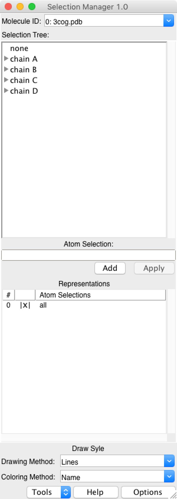
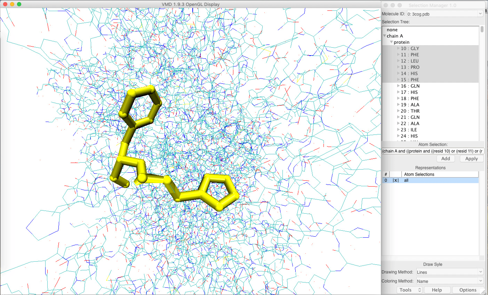
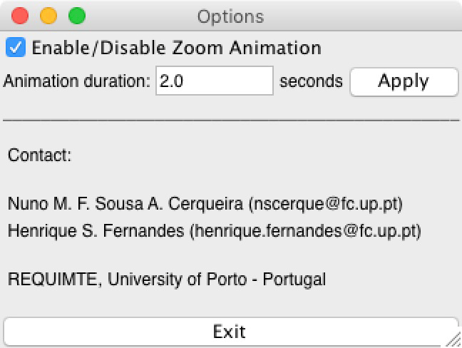
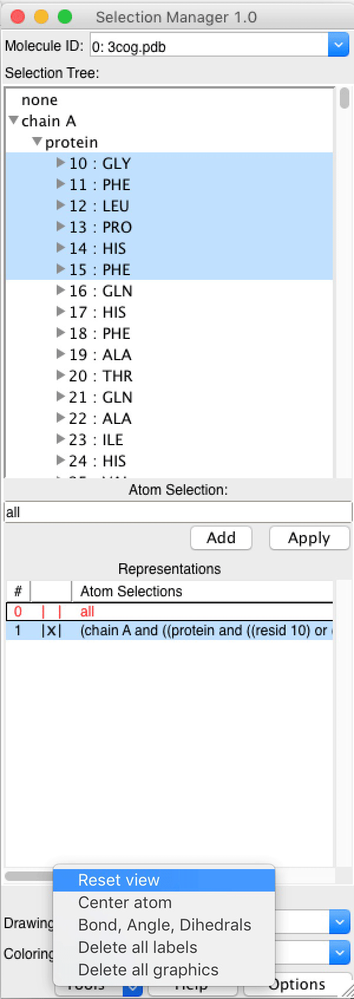
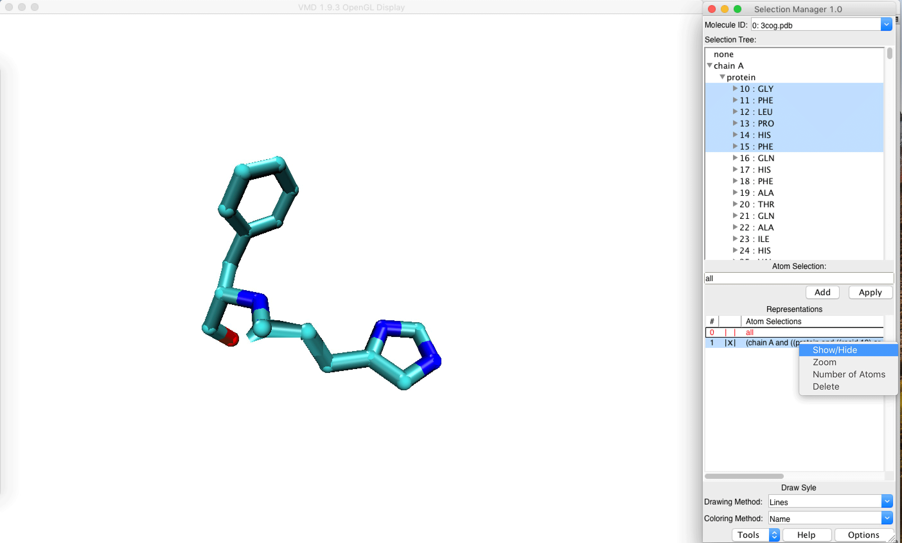

# Introduction
VMD is an exceptional program to visualize molecular structures. The main drawback of this software is the learning curve that turns it hard to use by non-expert users. One of the major difficulties that non-expert users have while handling VMD regards the selection of atoms. This is done through a series of keywords that the user must dominate in order to for example visualize and/or hide particular parts of the molecule, do specific transformations on the atoms of that selectin, etc.

In order to overcome this issues we have developed “Selection Manager”. This plug-in allows to do common selections on molecules without requiring any prior knowledge regarding the keywords available on VMD. It makes the selection of atoms simpler and easy for non-expert users. In addition it still allows the insertion of advanced commands but alerts the user for any error that might exist on the syntax.

## Minimum Requirements

Operating System: macOS, Linux or Windows
Visual Molecular Dynamics (VMD) 1.9.3 or later

## Installation

You could install selectionManager through [vmdStore](https://github.com/portobiocomp/vmdStore) (Recommended).

## Contacts
If you have any suggestion of new features, please contact us: nscerque@fc.up.pt

## Citation
Not available

## DOI
https://www.fc.up.pt/PortoBioComp/database/doku.php?id=selection_manager
